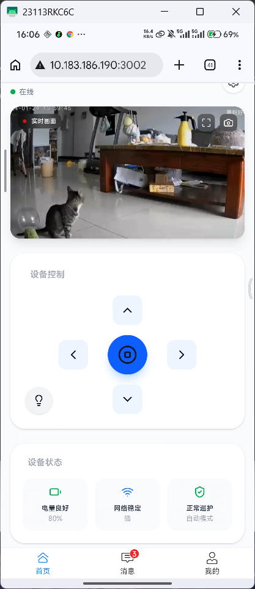
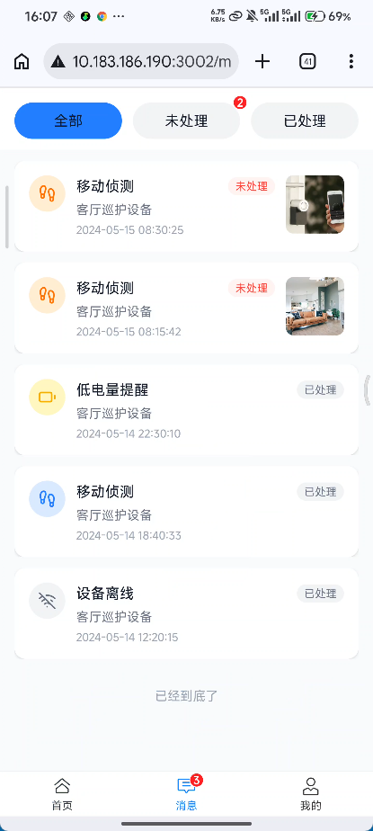
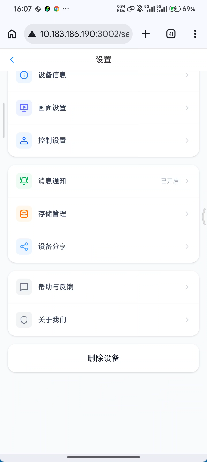

# Patrolix-App · 灵巡

智能机器人巡检与人脸识别监控系统

---

## 项目截图演示

> **[]** - 仪表盘首页：实时视频监控与设备控制界面
> 

> **[]** - 报警管理：报警记录列表与处理界面
> 
> **[]** - 设置界面

---

## 项目简介

**灵巡 (Patrolix-App)** 是一款基于 Vue 3 + TypeScript 的智能机器人巡检监控软件，支持 ESP32-CAM 或树莓派硬件平台，提供实时视频监控、人脸识别、远程控制等功能。

## 功能特性

### 📹 实时监控
- 实时视频流查看
- 全屏监控模式
- 画面截图功能

### 🤖 机器人控制
- 四向移动控制（前进、后退、左转、右转）
- 紧急停止功能
- 辅助设备控制（灯光等）

### 🔍 人脸识别
- 基于 MediaPipe 的实时人脸检测
- 人脸追踪与识别
- 异常人员报警

### 📊 数据管理
- 报警记录管理
- 历史截图查看
- 使用统计分析
- 设备状态监控

## 技术栈

- **前端框架**: Vue 3 + TypeScript
- **构建工具**: Vite
- **UI框架**: Vant + Tailwind CSS
- **图标库**: Lucide Vue
- **状态管理**: Pinia
- **路由管理**: Vue Router
- **图表库**: Chart.js + vue-chartjs
- **通信协议**: MQTT
- **人脸检测**: MediaPipe Face Detection（纯客户端实现，无需服务端）

## 硬件支持

| 平台 | 摄像头 | 推荐用途 |
|------|--------|----------|
| ESP32-CAM | OV2640 | 低成本小型巡检机器人 |
| 树莓派 4B+ | Pi Camera Module | 高性能智能监控 |

## 快速开始

### 环境要求

- Node.js >= 18.0.0
- npm >= 9.0.0

### 安装依赖

```bash
npm install
```

### 配置环境变量

复制 `.env.example` 文件并修改配置：

```bash
cp .env.example .env.local
```

编辑 `.env.local`：

```env
# 应用部署 URL
APP_URL="http://localhost:3000"

# MQTT 服务器配置（用于设备通信）
MQTT_BROKER="mqtt://localhost:1883"
MQTT_USERNAME="your-mqtt-username"
MQTT_PASSWORD="your-mqtt-password"
```

### 启动开发服务器

```bash
npm run dev
```

### 构建生产版本

```bash
npm run build
```

## 项目结构

```
src/
├── data/                 # 模拟数据
│   └── alerts.ts         # 报警记录数据
├── layouts/              # 布局组件
│   └── MainLayout.vue    # 主布局
├── router/               # 路由配置
│   └── index.ts          # 路由定义
├── stores/               # 状态管理
│   ├── useAlertStore.ts  # 报警状态
│   └── useAppStore.ts    # 应用全局状态
├── views/                # 页面组件
│   ├── Dashboard.vue     # 仪表盘首页
│   ├── Alerts.vue        # 报警记录列表
│   ├── AlertDetail.vue   # 报警详情
│   ├── FullScreenView.vue# 全屏监控
│   ├── History.vue       # 历史记录
│   ├── Screenshots.vue   # 截图管理
│   ├── Stats.vue         # 使用统计
│   ├── Settings.vue      # 系统设置
│   └── Profile.vue       # 用户资料
├── App.vue               # 根组件
├── main.ts               # 入口文件
└── index.css             # 全局样式
```

## 功能模块说明

### 1. 仪表盘 (Dashboard)
- 实时视频监控
- 设备控制面板
- 设备状态展示（电量、网络、模式）
- 快捷功能入口

### 2. 报警管理 (Alerts)
- 报警记录列表
- 报警详情查看
- 报警状态处理

### 3. 历史记录 (History)
- 历史视频回放
- 事件时间线

### 4. 截图管理 (Screenshots)
- 截图列表浏览
- 截图详情查看

### 5. 使用统计 (Stats)
- 设备运行统计
- 报警统计分析
- 图表可视化展示

### 6. 系统设置 (Settings)
- 网络配置
- 设备参数设置
- 用户偏好设置

## MQTT 通信协议

设备通过 MQTT 协议与服务端通信，支持以下主题：

| 主题 | 方向 | 说明 |
|------|------|------|
| `patrolix/device/{id}/control` | 下发 | 设备控制指令 |
| `patrolix/device/{id}/status` | 上报 | 设备状态信息 |
| `patrolix/device/{id}/video` | 上报 | 视频流数据 |
| `patrolix/device/{id}/alarm` | 上报 | 报警事件 |

## 人脸识别方案

系统采用 **MediaPipe Face Detection** 实现纯客户端人脸检测，无需依赖外部 API 服务：

- 完全本地运行，无需联网
- 基于 WebAssembly 技术，性能优异
- 支持实时人脸检测与追踪
- 无需配置 API 密钥

## 开发说明

### 代码规范

- 使用 TypeScript 进行类型检查
- 遵循 Vue 3 Composition API
- 使用 ESLint 进行代码检查

### 测试命令

```bash
# 类型检查
npm run lint

# 开发服务器
npm run dev

# 生产构建
npm run build

# 预览构建结果
npm run preview
```

## 许可证

MIT License

## 贡献

欢迎提交 Issue 和 Pull Request！